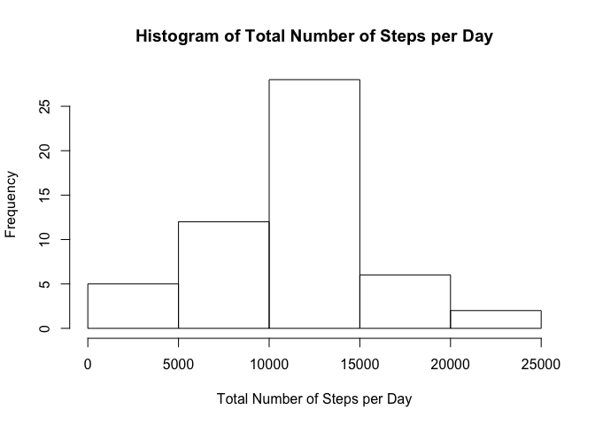
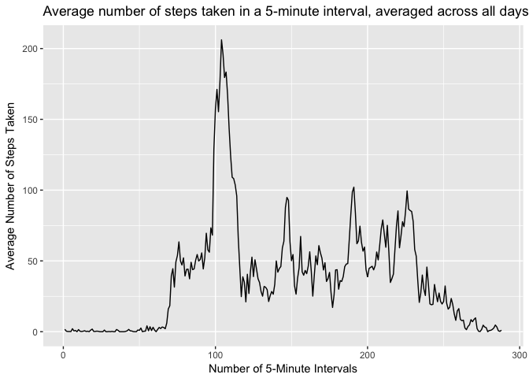
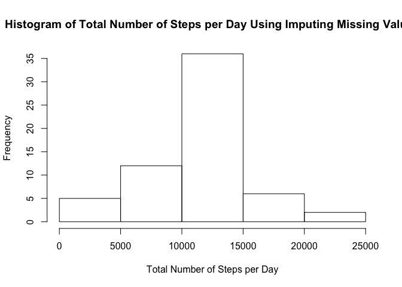
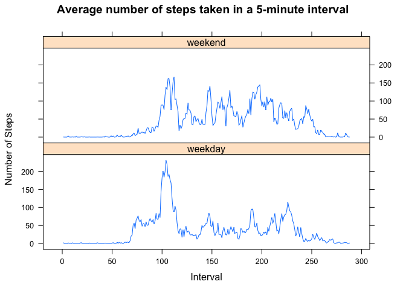

# Reproducible Research: Peer Assessment 1

## Loading and preprocessing the data
- Read and review the structure of activy data

```r
db <- read.csv("activity.csv")
str(db)
```

```
## 'data.frame':	17568 obs. of  3 variables:
##  $ steps   : int  NA NA NA NA NA NA NA NA NA NA ...
##  $ date    : Factor w/ 61 levels "2012-10-01","2012-10-02",..: 1 1 1 1 1 1 1 1 1 1 ...
##  $ interval: int  0 5 10 15 20 25 30 35 40 45 ...
```

- Make a dataframe without missing values 

```r
db1<- na.omit(db)
dim(db1)
```

```
## [1] 15264     3
```

## What is mean total number of steps taken per day?
- Calculate the total number of steps taken per day
- Make a histogram of the total number of steps taken each day


```r
ts <- aggregate(steps ~ date, db1, sum)
hist(ts$steps, xlab="Total Number of Steps per Day", main="Histogram of Total Number of Steps per Day")
```

<!-- -->

- Calculate and report the mean and median of the total number of steps taken per day

```r
mean(ts$steps)
```

```
## [1] 10766.19
```

```r
median(ts$steps)	
```

```
## [1] 10765
```
## What is the average daily activity pattern?
- Make a time series plot of the 5-minute interval (x-axis) and the average number of steps taken, averaged across all days (y-axis)

```r
timeseries<-aggregate(steps ~ as.factor(interval), db1, mean)
names(timeseries)[names(timeseries )=="as.factor(interval)"] <- "interval"
names(timeseries)[names(timeseries )=="steps"] <- "avesteps"
library(ggplot2)
ggplot(timeseries, aes(as.numeric(interval), avesteps)) + geom_line() + xlab("Number of 5-Minute Intervals") + ylab("Average Number of Steps Taken")+ ggtitle("Average number of steps taken in a 5-minute interval, averaged across all days")
```

<!-- -->


- Which 5-minute interval, on average across all the days in the dataset, contains the maximum number of steps?

```r
maxsteps<-which(timeseries$steps == max(timeseries$steps))
```

```
## Warning in max(timeseries$steps): no non-missing arguments to max;
## returning -Inf
```

```r
timeseries[maxsteps,]$interval
```

```
## factor(0)
## 288 Levels: 0 5 10 15 20 25 30 35 40 45 50 55 100 105 110 115 120 ... 2355
```
The maximum number of steps, averaged across all the days in the dataset, is at 8:35AM. 

## Imputing missing values
- Calculate and report the total number of missing values in the dataset (i.e. the total number of rows with 𝙽𝙰s)

```r
number_of_nas <- dim(db)[1] - dim(db1)[1]
length(which(is.na(db$steps)))
```

```
## [1] 2304
```
The original dataset contains 2304 missing values. 

We will now apply a strategy to impute the missing values in the dataset. The strategy uses the mean for the corresponding 5-minute interval.

- Create a new dataset that is equal to the original dataset but with the missing data filled in.

```r
db <- read.csv("activity.csv")
db$interval<- as.factor(db$interval)
mrg<- merge(db, timeseries, by="interval")
mv <- which(is.na(mrg$steps))
mrg[mv,]$steps <- mrg[mv,]$avesteps
head(mrg)
```

```
##   interval    steps       date avesteps
## 1        0 1.716981 2012-10-01 1.716981
## 2        0 0.000000 2012-11-23 1.716981
## 3        0 0.000000 2012-10-28 1.716981
## 4        0 0.000000 2012-11-06 1.716981
## 5        0 0.000000 2012-11-24 1.716981
## 6        0 0.000000 2012-11-15 1.716981
```

- Make a histogram of the total number of steps taken each day 

```r
ts <- aggregate(steps ~ date, mrg, sum)
hist(ts$steps, xlab="Total Number of Steps per Day", main="Histogram of Total Number of Steps per Day Using Imputing Missing Values")
```

<!-- -->

- Calculate and report the mean and median of the total number of steps taken per day with imputed missing values.  Do these values differ from the estimates from the first part of the assignment? 

```r
mean(ts$steps)
```

```
## [1] 10766.19
```

```r
median(ts$steps)
```

```
## [1] 10766.19
```
The mean value did not change but the median increased and became equal to the mean. 

- What is the impact of imputing missing data on the estimates of the total daily number of steps?

The frequency of the middle bucket increased as we added more average observations.

## Are there differences in activity patterns between weekdays and weekends?
 - Create a new factor variable in the dataset with two levels – “weekday” and “weekend” indicating whether  a given date is a weekday or weekend day.

```r
wend<-c("Saturday", "Sunday")
mrg$weekend<- factor(ifelse(weekdays(as.Date (mrg[,]$date)) %in% wend, "weekend", "weekday"))
```

- Make a panel plot containing a time series plot of the 5-minute interval (x-axis) and the average number of steps taken, averaged across all weekday days or weekend days (y-axis). 

```r
wts<-aggregate(steps ~ as.factor(interval) + weekend, mrg, mean)
names(wts)[names(wts)=="as.factor(interval)"] <- "interval"
library(lattice)
xyplot(steps~as.numeric(interval)|weekend, data=wts, pch=19, layout=c(1,2), type="l", xlab="Interval", ylab="Number of Steps", main="Average number of steps taken in a 5-minute interval")
```

<!-- -->

On weekends, there is more activity in the middle of the day. On weekdays, the activity starts earlier in the day; however, overall is less than that on weekends.

